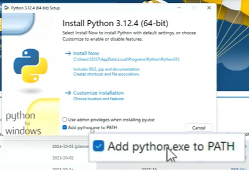

# Curso de Python (En construcción)

En este curso repasarémos los conceptos fundamentales de Python, para que poder crear cualquier proyecto.

**Conocimientos previos:**
- Programación Básica
- Software para este curso
- Editor de código
- Python 3

**Duración:** 4 Horas de contenido - 10 Horas de práctica

**Instructora:** Carli Florida - Teacher In-house en Platzi

## Temario y recursos del Curso de Python

██ (COMPLETAR) ██

## Módulo 1: Fundamentos de Programación y Python

### 1.  **¿Por qué aprender Python?**
---

██ (COMPLETAR) ██

Quien lo creó? cuando?1991. Filosfia de simplicidad
    
es de alto nivel,cercano al lenguage humano(ingles)
    
tipado dinámico
    
paradigmas (poo y funcional)
  
### 2. **Introducción a Python**
---
    
¿Cómo instalar Python en Windows?

- Ve al navegador y escribe “Python”.
- Asegúrate de entrar a python.org y haz clic en la sección de descargas.
 
- Descarga el instalador y ábrelo.
- Marca la opción “Add Python to PATH” y selecciona “Install Now”.
 
- Una vez instalado, abre la terminal o cmd y escribe “python” para comprobar la instalación.

¿Cómo instalar Python en Mac?
- Abre tu navegador y escribe “Python”.
- Asegúrate de ingresar a python.org.
- En la sección de descargas, la página detectará tu sistema operativo MacOS automáticamente.
- Descarga el instalador, ábrelo y sigue las instrucciones: “Continuar”, “Aceptar términos y condiciones” e “Instalar”.
- Confirma que Python está instalado abriendo la terminal y escribiendo “python”.

¿Cómo usar Visual Studio Code para Python?
- Descarga Visual Studio Code desde code.visualstudio.com.
- Instala el editor y ábrelo.
- Crea una nueva carpeta para tus proyectos, por ejemplo, “Curso Python”.
- Abre la carpeta en Visual Studio Code y crea un archivo nuevo con la extensión .py (por ejemplo, hola.py).
- Escribe print("Hola Mundo") en el archivo.
- Guarda el archivo (Ctrl+S) y ejecuta el código usando el botón de ejecutar en Visual Studio Code.
- Asegúrate de tener instalada la extensión de Python para una mejor experiencia de codificación.

Recuerda que Python es un lenguaje interpretado, lo que significa que las instrucciones se ejecutan directamente sin necesidad de compilación previa, facilitando la visualización inmediata de resultados.

**Ver archivos:**

- Función print: [2_1_print.ipynb](files/2_1_print.ipynb)
- hola Mundo: [2_2_holaMundo.py](file/2_2_holaMundo.py)

### 3. Conceptos Básicos de Programación

**La Sintaxis y la Semántica**

La sintaxis y la semántica son dos conceptos fundamentales en programación. Estas son sus caracteristicas:

**Sintaxis:**

La sintaxis se refiere a la estructura de un programa escrito en un lenguaje de programación.

Describe cómo se debe escribir el código para que sea válido según las reglas del lenguaje.

Los errores sintácticos ocurren cuando no seguimos las reglas gramaticales del lenguaje.

Por ejemplo, si olvidamos cerrar un paréntesis o escribimos mal una palabra clave, estamos cometiendo errores de sintaxis.

**Semántica:**

La semántica se relaciona con el significado detrás del código.

Describe qué debe hacer el programa y cómo se relacionan las diferentes partes del código para lograr un objetivo.

Los errores semánticos no se detectan en tiempo de compilación, sino en tiempo de ejecución.

Por ejemplo, si asignamos un valor incorrecto a una variable o realizamos una operación lógica incorrecta, estamos cometiendo errores de semántica.

Ver archivos:

- Sintaxis de Python: [sintaxis.ipynb](files\3_1_sintaxis.ipynb)

-----

██ (COMPLETAR) ██
-----

4. Práctica: Te doy la bienvenida a los ejercicios interactivos
5. Manipulación de Cadenas de Texto en Python
6. Enteros, Flotantes y Booleanos
7. Todo lo que Debes Saber sobre print en Python
8. Operaciones Matemáticas en Python
9. Operaciones de Entrada/Salida en Consola

## Módulo 2: Colección y Procesamiento de Datos en Python
10. Listas
11. Método slice
12. Listas de más dimensiones y Tuplas
13. Aplicación de Matrices
14. Diccionarios
15. Control de Flujo en Python

## Módulo 3: Estructuras condicionales

16. Bucles y Control de Iteraciones
17. Generadores e Iteradores

## Módulo 4: Funciones y Manejo de Excepciones en Python
18. Uso de Funciones en Python (17:53)
19. Funciones Lambda y Programación Funcional en Python
20. Manejo de Excepciones en Python y uso de pass
21. ¿Cómo realizar una función recursiva en Python?

## Módulo 5: Programación Orientada a Objetos en Python

22. Fundamentos de Programación Orientada a Objetos en Python
23. Ejercicio Biblioteca con POO
24. Herencia en POO con Python
25. Objetos heredados
26. Los 4 pilares de la programacion orientada a objetos
27. Superando los Fundamentos de Programación Orientada a Objetos en Python
28. Proyecto final: Guerra naval

_Fuentes:_ 
*   _CLASE 3 Apuntes de Daniel Chambueta, estudiane de Platzi_
